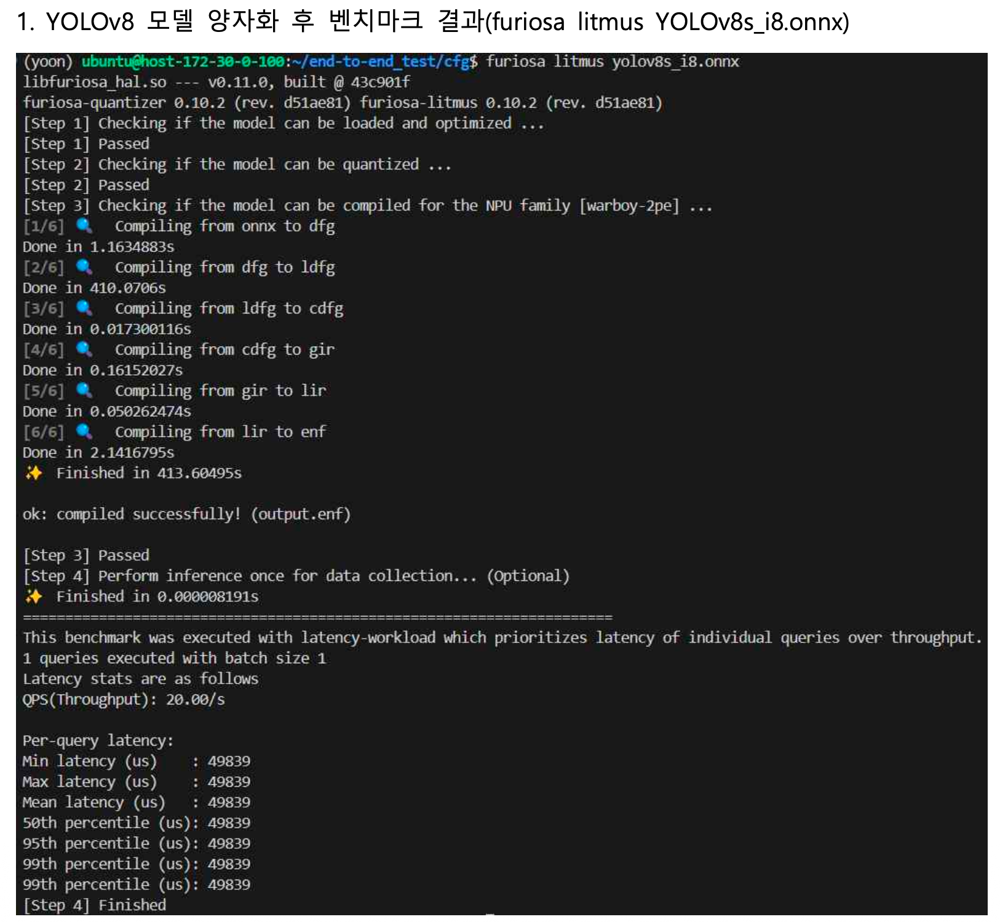
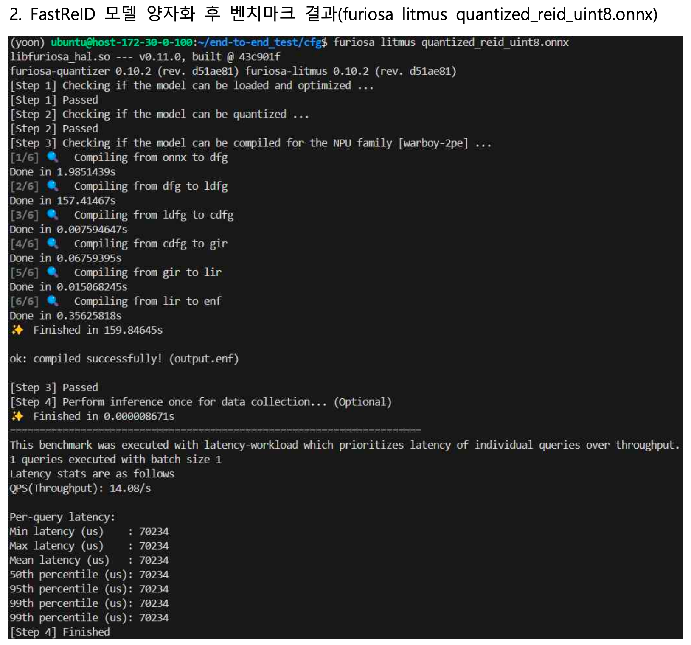
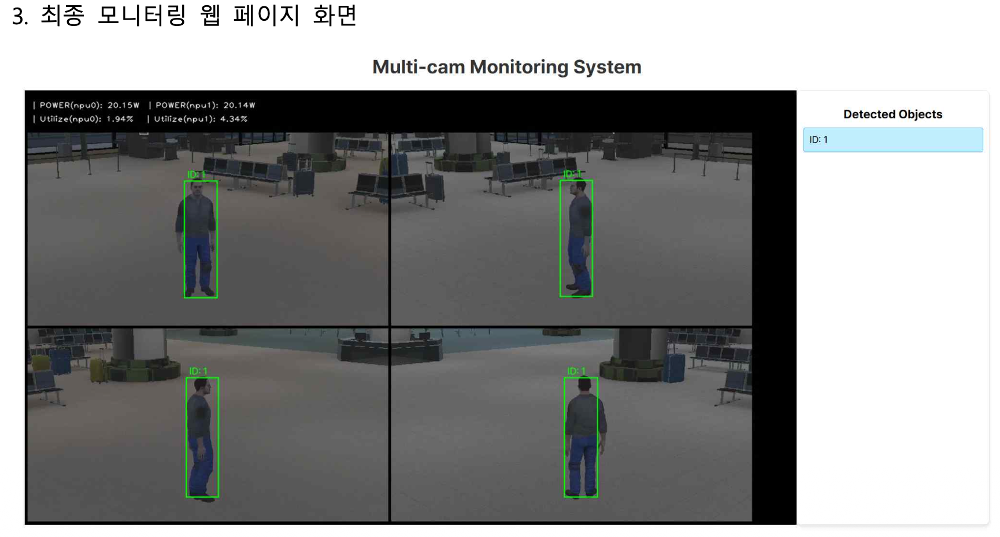

# NPU-Accelerated Multi-Camera Security System

A four-camera airport monitoring prototype built for the **1st AI Semiconductor Talent Competition (MSIT / NIPA, 2024)**.

The project connects a simulated CCTV environment to a Furiosa **Warboy NPU** inference server, runs person detection and appearance-feature extraction with quantized models, tracks identities per camera, and exposes the results through a lightweight FastAPI + web monitoring stack.

> This repository is best read as a **system integration project**, not as an isolated model benchmark: camera streaming, NPU inference, tracking state, result serving, and operator visualization are connected end to end.

---

## What the system does

The prototype was designed around an airport CCTV scenario with four simultaneous camera feeds.

The pipeline:

1. reads four camera views from an airport simulator,
2. publishes the streams over RTMP,
3. runs **YOLOv8s** person detection on a Furiosa Warboy NPU,
4. extracts **FastReID** appearance embeddings,
5. associates detections with existing tracks using cosine similarity + Hungarian matching,
6. stores the latest tracking results,
7. merges the four camera views into a monitoring stream, and
8. serves both video and tracking metadata to a browser-based dashboard.

### Key components

| Component | Implementation |
|---|---|
| Person detection | YOLOv8s |
| Appearance embedding | FastReID |
| Accelerator | Furiosa Warboy NPU |
| Model format | ONNX / INT8 |
| Track association | Cosine distance + Hungarian assignment |
| Multi-camera input | 4 RTMP streams |
| API / result serving | FastAPI + Uvicorn |
| Monitoring UI | HTML / JavaScript |
| Streaming | FFmpeg + RTMP |
| Image processing | OpenCV / NumPy |

---

## System architecture

```mermaid
flowchart LR
    subgraph LocalPC["Local PC / Airport Simulator"]
        SIM["Airport Simulator"]
        SHM["Shared Memory"]
        STREAM["Streaming Process"]
        RTMP["RTMP Server"]

        SIM -->|frames| SHM
        SHM --> STREAM
        STREAM --> RTMP
    end

    subgraph NPU["NPU Server"]
        PRE["Preprocessor"]
        YOLO["YOLOv8s\nPerson Detection"]
        REID["FastReID\nAppearance Embedding"]
        TRACK["Track Association"]
        POST["Result / Frame Writer"]
        API["FastAPI Server"]

        PRE --> YOLO
        YOLO --> REID
        REID --> TRACK
        TRACK --> POST
        POST --> API
    end

    subgraph Client["Administrator PC"]
        WEB["Multi-cam Web Monitor"]
        USER["Operator"]

        WEB --> USER
    end

    RTMP --> PRE
    RTMP --> WEB
    API --> WEB
```



The original prototype separates the system into three practical roles:

- **Local PC** — simulator capture and RTMP publishing
- **NPU server** — preprocessing, inference, tracking, and result serving
- **Administrator PC** — four-camera monitoring and object selection

---

## NPU inference pipeline

### 1. YOLOv8s person detection

`YOLODetector` loads the quantized model through the Furiosa runtime and filters the decoded detections to the `person` class.

The detector configuration in `cfg/yolov8s.yaml` uses:

- input resolution: **640 × 640**
- confidence threshold: **0.25**
- IoU threshold: **0.70**
- INT8 model: `cfg/yolov8s_i8.onnx`

```python
self.runner = create_runner(model_path, device="warboy(2)*1")
```

### 2. FastReID appearance features

For every valid person crop, `FastReIDExtractor`:

- resizes the crop to **128 × 256**,
- runs the quantized ReID model on the Warboy NPU,
- L2-normalizes the output embedding, and
- keeps a small feature cache to avoid redundant extraction for identical patches.

### 3. Track association

Each camera owns a `CameraTracker`.

For a new frame:

- detection embeddings are compared with active track embeddings,
- the cost matrix is defined as `1 - cosine_similarity`,
- **Hungarian assignment** (`scipy.optimize.linear_sum_assignment`) finds candidate matches,
- matches are accepted above a cosine-similarity threshold of **0.7**, and
- unmatched detections create new tracks.

Tracks move from `tentative` to `confirmed` after repeated observations and are removed after aging out.

> **Scope note:** in the current repository snapshot, tracking state is maintained **per camera**. FastReID features are used for appearance-based association inside each camera tracker, while the web monitor aggregates the resulting IDs from all camera feeds. A dedicated global cross-camera identity-association layer is not implemented in this version.

---

## Warboy benchmark results

The supplied Furiosa `litmus` benchmark captures show successful quantization / compilation for the Warboy 2PE target.

| Model | Benchmark mode | QPS | Per-query latency |
|---|---:|---:|---:|
| YOLOv8s INT8 | batch 1, latency workload | **20.00 / s** | **49.839 ms** |
| FastReID INT8 | batch 1, latency workload | **14.08 / s** | **70.234 ms** |

These numbers are **model-level `litmus` measurements**, not end-to-end four-camera system throughput.

### Suggested benchmark screenshots

If you add the screenshots used in the project report under `docs/images/`, the following filenames work with this README:

```text
docs/images/
├── yolov8s-warboy-benchmark.png
├── fastreid-warboy-benchmark.png
├── monitoring-dashboard.png
└── high-level-architecture.png
```

Then you can uncomment or add:

```md


```

---

## Monitoring pipeline

### Four-camera input

`Monitor.py` reads simulator frames from Windows shared-memory buffers:

```text
CameraSharedMemory_0
CameraSharedMemory_1
CameraSharedMemory_2
CameraSharedMemory_3
```

Each feed is encoded with FFmpeg and published to an RTMP endpoint.

The default demo configuration expects:

```yaml
video_path:
  - rtmp://<server>/live/0000
  - rtmp://<server>/live/0001
  - rtmp://<server>/live/0002
  - rtmp://<server>/live/0003
```

### Result serving

`tools/stream.py` starts a FastAPI service that exposes:

- `/` — merged four-camera MJPEG stream
- `/tracking-data` — current tracking metadata as JSON

The stream also overlays Warboy power / utilization information collected from Furiosa device performance counters.

### Web monitor

`output.html`:

- displays the merged 2×2 camera grid,
- fetches tracking metadata every second,
- lists the currently detected IDs, and
- lets the user select an ID and highlight its bounding box on the corresponding camera view.

Example tracking record:

```json
{
  "camera_id": 0,
  "global_id": 1,
  "bbox": [455, 136, 555, 501],
  "frame_path": "tracking_results/0000/0000000001.bmp"
}
```

### Suggested monitoring screenshot

After adding the provided dashboard capture to:

```text
docs/images/monitoring-dashboard.png
```

embed it with:

```md
<p align="center">
  
</p>
```

---

## Repository structure

```text
.
├── main.py
│   ├── Warboy model runners
│   ├── YOLOv8s person detection
│   ├── FastReID feature extraction
│   ├── per-camera track association
│   └── tracking-result writer
│
├── Monitor.py
│   └── shared-memory capture → FFmpeg → RTMP
│
├── output.html
│   └── browser monitoring UI
│
├── demoapp.yaml
│   └── four RTMP input streams + output directory
│
├── cfg/
│   ├── yolov8s.yaml
│   ├── yolov8s.pt
│   ├── yolov8s.onnx
│   ├── yolov8s_i8.onnx
│   └── quantized_reid_uint8.onnx
│
├── tools/
│   └── stream.py
│       └── FastAPI MJPEG + JSON result server
│
├── tracking_results/
│   ├── 0000/ ... 0003/
│   └── tracking_data.json
│
└── utils/
    ├── preprocess.py
    ├── postprocess.py
    ├── result_img_process.py
    ├── parse_params.py
    └── postprocess_func/
```

---

## Running the prototype

The repository contains environment-specific paths and was written for the original competition setup, so the following is the **prototype run flow**, not a plug-and-play installation guide.

### 1. Publish the camera streams

On the simulator / Windows side, run:

```bash
python Monitor.py
```

`Monitor.py` expects four simulator shared-memory buffers and publishes streams `0000` through `0003`.

Before starting inference, the project notes recommend checking the streams directly:

```bash
ffplay rtmp://<server>/live/0000
ffplay rtmp://<server>/live/0001
ffplay rtmp://<server>/live/0002
ffplay rtmp://<server>/live/0003
```

### 2. Configure the RTMP endpoints

Update `demoapp.yaml` to point at the active streams.

### 3. Start tracking + result serving

On the Warboy NPU server:

```bash
python main.py demoapp.yaml
```

`main.py` initializes the quantized detector / ReID models and launches `tools/stream.py` for the monitoring API.

### 4. Open the monitor

Open `output.html` in a browser.

The page expects the FastAPI service at:

```text
http://localhost:20001/
```

and tracking metadata at:

```text
http://localhost:20001/tracking-data
```

---

## Key dependencies

The code imports or relies on:

- Python
- Furiosa Runtime / Furiosa Device API
- OpenCV
- NumPy
- SciPy
- FastAPI
- Uvicorn
- FFmpeg
- PyYAML
- Typer
- psutil

Exact package versions are not pinned in the current repository.

---

## Engineering decisions visible in the code

This prototype contains several system-level choices beyond the model itself:

- **NPU-first inference** — both person detection and ReID embeddings run through the Furiosa runtime.
- **Separate detection and appearance stages** — bounding-box detection and identity features remain modular.
- **Frame synchronization** — multi-stream frames are filtered with a 50 ms synchronization window.
- **Bounded state** — track history and ReID caching use bounded containers.
- **Observable deployment** — the merged stream includes device power / utilization information.
- **Simple handoff boundary** — video is streamed separately from tracking metadata, allowing the web client to render interaction without modifying the inference loop.

---

## Project context & contribution

This project was developed by a **four-person team** for the 2024 AI Semiconductor Talent Competition.

My work focused on integrating the vision pipeline into the end-to-end monitoring system. Model conversion / quantization and Warboy deployment were collaborative team work; this README intentionally does not present those steps as individual-only contributions.

The main engineering value of the project was learning how an AI model changes once it has to operate as part of a real system:

> **camera stream → preprocessing → NPU inference → tracking state → API → operator monitor**

---

## Notes

- The repository contains large model binaries and generated build artifacts from the original development environment.
- RTMP addresses and simulator shared-memory names are environment-specific.
- The current snapshot is an experimental competition prototype, not a production surveillance system.
